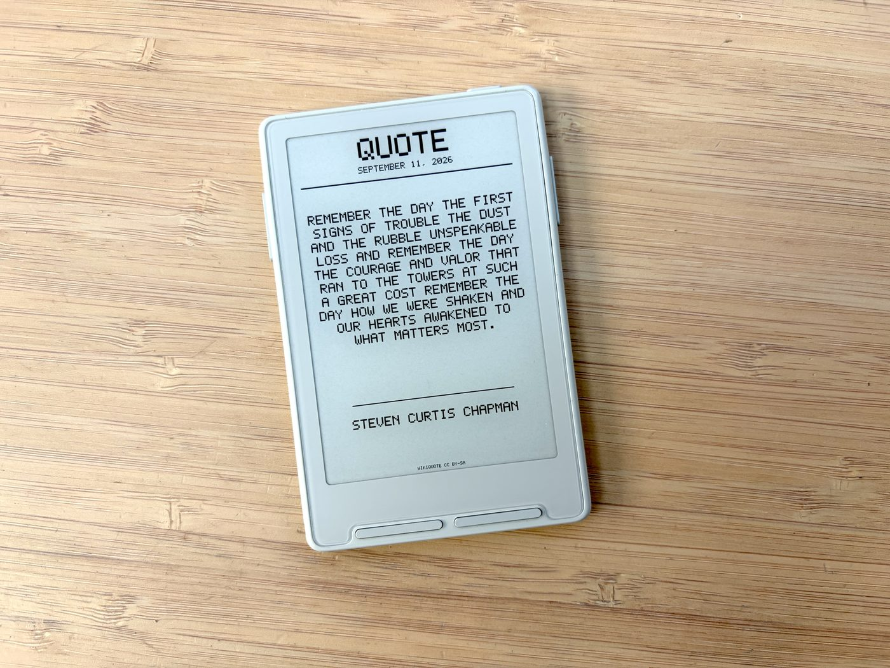
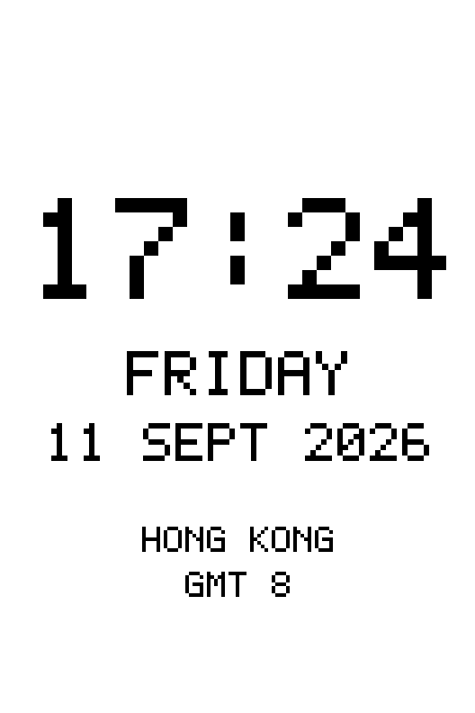
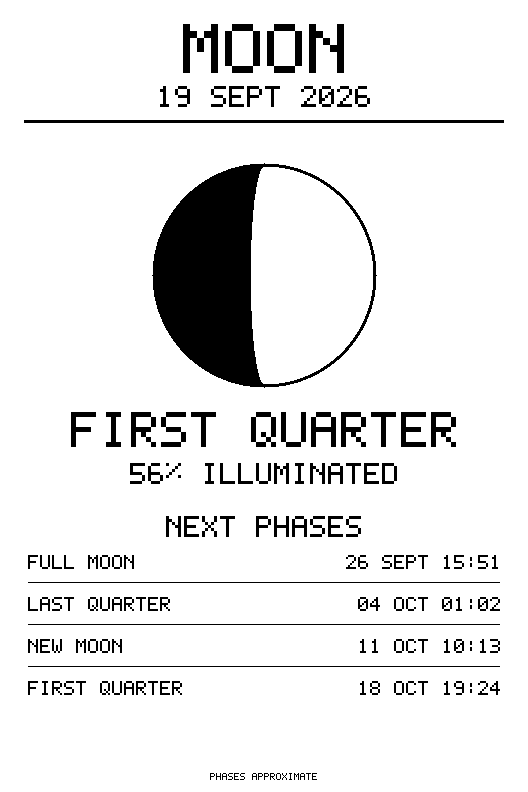
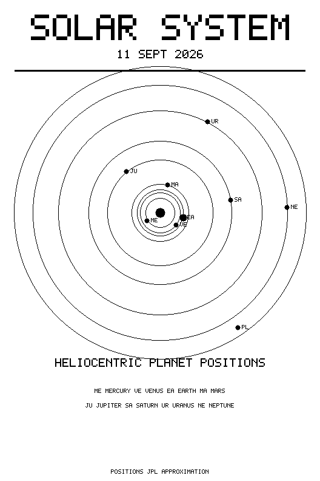

# CrossPoint Cards

A fork of [CrossPoint Reader](https://github.com/crosspoint-reader/crosspoint-reader) that turns the
e-reader into an always-on e-ink card display, without giving up the reader.

Everything CrossPoint does — EPUB rendering, dictionaries, OPDS, KOReader sync — still works. This
fork adds one thing: **Cards**.



---

## What Cards does

A card is a URL to a 1-bit BMP, and nothing else. The firmware fetches it, checks it, draws it, and
sleeps until the next refresh. It has no idea whether it is showing a clock, the weather or a photo —
everything that distinguishes one card from another lives in the URL.

That is the whole design, and it is deliberate. Adding a new kind of card needs no firmware change.

- **Six slots.** Each holds a complete HTTPS URL and its own refresh interval
  (1, 2, 5, 10, 15, 30, 60, 120 or 240 minutes).
- **Display mode.** Open a card from **Main Menu → Cards** and it stays on screen, refreshing in
  place with the radio off between fetches. Back leaves.
- **Sleep screen.** Set **Settings → Display → Sleep Screen** to *Card* and pick one under
  *Sleep Card*. The device then wakes on a timer, refreshes that card, and sleeps again — the panel
  keeps showing the card the whole time.

The image is validated before it replaces the one on screen, and the previous card is kept until a
new one has been written successfully, so a failed refresh never leaves a blank panel.

## Where the pictures come from

`examples/cloudflare-dashboard-worker.js` is a single-file Cloudflare Worker that renders the cards.
Deploy it to your own account, then paste its URLs into the six slots.

### The eight cards

<table>
<tr>
<td width="25%"></td>
<td width="25%"></td>
<td width="25%"></td>
<td width="25%"></td>
</tr>
<tr>
<td align="center"><b>clock</b></td>
<td align="center"><b>weather</b></td>
<td align="center"><b>moon</b></td>
<td align="center"><b>today</b></td>
</tr>
<tr>
<td></td>
<td></td>
<td></td>
<td></td>
</tr>
<tr>
<td align="center"><b>quote</b></td>
<td align="center"><b>bitcoin</b></td>
<td align="center"><b>solar</b></td>
<td align="center"><b>astro</b></td>
</tr>
</table>

**`/clock.bmp`** — Time, day and date, with the place underneath. Takes `location=HKG` or any IANA
zone; see the note on `lead` and `round` below. The only card worth a one-minute interval.

**`/weather.bmp`** — Current conditions, feels-like, humidity, wind and rain chance, sunrise and
sunset, then a five-day strip. `location=London,GB`, exact `lat`/`lon`, or `location=auto` to use the
Worker's guess from the request. `units=imperial` for °F and mph.

**`/moon.bmp`** — Tonight's phase drawn to its real illuminated fraction, with the next four phases
and their times. Falls back to its own computed phases if the US Naval Observatory is unreachable,
and says so in the footer when it does.

**`/today.bmp`** — On this day, from Wikipedia's feed. `lang=en` selects the language edition, so a
German or Japanese reader gets that edition's events rather than a translation.

**`/quote.bmp`** — Wikiquote's quote of the day. Poems and lyrics keep their line breaks; prose
flows to fill the card.

**`/bitcoin.bmp`** — BTC/USD, the 24-hour change, and a seven-day line chart with its high and low.

**`/solar.bmp`** — The planets at their real heliocentric longitudes, computed on the Worker from
JPL's Keplerian elements. No upstream service, so it cannot fail.

**`/astro.bmp`** — A full astrological chart: planets, houses, and aspect lines. `houses=placidus`
(default), `whole` or `equal`; `orb=1..12` for the aspect orb. Pass `date` and `time` for a chart of
some other moment rather than now. Also computed entirely on the Worker.

> The renders above are the Worker's own output at the X3's 528×792. The clock, moon, solar and astro
> cards show genuinely computed values; the weather and bitcoin figures are sample data, since those
> cards read live services.

Open the Worker's root URL for the full parameter list, and `/locations.txt` for the 81 location
codes.

```
https://your-worker.workers.dev/clock.bmp?device=x3&location=HKG&lead=90&round=5
https://your-worker.workers.dev/weather.bmp?device=x3&location=London,GB
https://your-worker.workers.dev/astro.bmp?device=x3&location=LON&houses=whole
```

Two clock parameters are worth knowing about. The device shows what the Worker rendered some seconds
earlier, so `lead=90` renders that far ahead and the card is right *when it appears*; `round=5` snaps
the displayed time to a coarser mark. Together they make a clock that reads correctly instead of
always trailing the fetch.

`device` and `orientation` set the bitmap size (`x3`/`x4`, `portrait`/`landscape`).

No card needs an API key. The clock, solar system and astro chart are computed inside the Worker from
first principles, so they work even when the internet is having a bad day. The rest read public,
keyless services — Open-Meteo for weather, the US Naval Observatory for moon phases, Wikimedia for
*On this day* and the quote, Coinbase for the BTC price — and a card is only as reliable as the
service behind it. A failed refresh leaves the last good card on screen rather than a blank panel.

## Deploying the Worker

You need a free Cloudflare account. Nothing is paid, and no card details are asked for.

```bash
npm install -g wrangler
wrangler login

mkdir -p cards/src && cd cards
cp /path/to/crosspoint-cards/examples/cloudflare-dashboard-worker.js src/index.js
```

Add a `wrangler.toml` next to it:

```toml
name = "cards"
main = "src/index.js"
compatibility_date = "2025-01-01"
```

Then:

```bash
wrangler deploy
```

Wrangler prints your URL — `https://cards.<your-subdomain>.workers.dev`. Open it in a browser: the
root path lists every route and parameter. Add `/clock.bmp?device=x3` and you should get a bitmap.
Those are the URLs to paste into the six card slots.

If you prefer not to install anything, the Cloudflare dashboard works too: **Workers & Pages → Create
→ Worker**, then paste the contents of `cloudflare-dashboard-worker.js` into the editor and deploy.
It is one self-contained file with no dependencies, so there is nothing to build.

A Worker on the free plan allows 100,000 requests a day. A device refreshing every 15 minutes uses
about a hundred, so the limit is not something you will meet. Each card is rendered fresh on request
and nothing is cached or stored, which is the right trade for a handful of your own devices; if you
ever point a crowd at one Worker, add cache headers first, for the sake of the upstream services more
than Cloudflare.

## Install

Build from the **Actions** tab: *Build one board* → `gh_release` → download `firmware.bin` and flash
it with the [CrossPoint web installer](https://crosspointreader.com). Tagged releases build every
board through *Compile Release*.

Then open the device's web interface (**Settings → System → WiFi**, then browse to its address) and
paste your card URLs under **Cards**. Intervals live under **Settings → System** on the device or in
the same web page.

## Status

Developed and tested on an **Xteink X3**. It builds for every board CrossPoint supports, but the
timed sleep that drives the sleep-screen card is implemented for the ESP32-C3 boards (X3/X4); on
other boards a card sleeps on its timer without the power button armed as a second wake source.

Known limitation, inherited from upstream and present in stock CrossPoint 1.6 on the same hardware:
**downloading fonts** through Manage Fonts fails on the X3 with a memory error. The font list loads;
the download does not. Copy fonts to the SD card instead.

## Development

See the upstream [contributing docs](./docs/contributing/README.md) — the build, formatting and
testing workflow is unchanged.

```bash
git clone --recursive https://github.com/petereading/crosspoint-cards
cd crosspoint-cards
pio run -e default
```

## Credits

CrossPoint Reader is built by [its contributors](https://github.com/crosspoint-reader/crosspoint-reader/graphs/contributors)
and everything good about this firmware comes from them. This fork only adds the card layer on top.

The card idea began as [t0nyz0/crosspoint-reader-lockscreens](https://github.com/t0nyz0/crosspoint-reader-lockscreens);
the implementation here was rewritten around URL slots and no longer shares code with it.

MIT licensed — see [LICENSE](./LICENSE). Copyright remains with the original authors.

CrossPoint Reader is **not affiliated with Xteink or any device manufacturer**.
